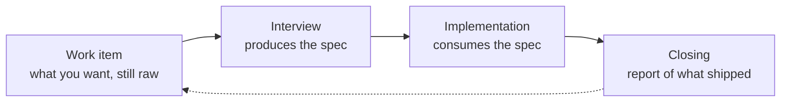
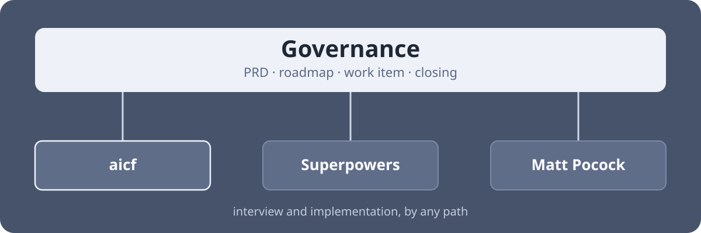

# AI Coding Flow Skills

_[Versão em português](README.md)_

`aicf` is a Claude Code skill plugin that handles project governance: the PRD, the roadmap, the record of each work item, and the report of what shipped. There are six skills, and they work on top of the implementation path you already use.

Superpowers, Matt Pocock and spec-kit cover one work item at a time, and cover it well. Three questions go unanswered:

- **Where does the project stand?** Specs describe each change, one by one. None of them says what the product is, who it serves, and what was ruled out by decision.
- **Why did we decide against that?** The reason for dropping an approach stayed in the conversation with the agent, and the conversation is not saved. Weeks later the same argument comes back.
- **What actually shipped?** The spec and the plan were written before execution. Neither of them is updated with what changed during implementation.

> **Written in Portuguese.** The skills instruct the agent in pt-BR and the file conventions mix the playbook's terms with Portuguese names (`intents/` and `specs/` for the two states of a work item, `backlog/`, `concluidas/` for completed). The GitHub labels of the issue mode are the same words: `aicf:backlog`, `aicf:intent`, `aicf:spec`. They work fine in an English-speaking session: Claude reads the instructions and answers you in whatever language you write. If you want the artifacts named in English, fork and translate.

## Install

```
/plugin marketplace add hmaurus/skills
/plugin install aicf@aicodingflow
```

Restart your session afterwards. Skills load at the start of a session and do not hot-swap.

On a new project, start with `/aicf:setup`. On an existing one, start with `/aicf:workflow-demanda`, which explains the cycle.

## The cycle

Every work item goes through the same four phases.



- **Work item** — the idea recorded, even before it is mature.
- **Interview** — questions until no decision is left open. A spec comes out.
- **Implementation** — someone executes the spec, by any path.
- **Closing** — the report of what was done, including what came out different from the plan.

Each work item is a versioned file in the repository, or a GitHub issue. You pick which one at setup.

## The problem this solves



### Where does the project stand?

`/aicf:criar-prd` interviews you and writes `PRD.md`. It has a "ruled out, by decision" section, which holds what you decided against and why.

### Why did we decide against that?

`/aicf:criar-spec` runs the interview for a work item and writes the result to a file in the repository, including what was decided **against**.

### What actually shipped?

`/aicf:fechar-demanda` asks for a report of what shipped and keeps it with the work item. It runs on any implementation path, including the ones that are not `aicf`'s.

## Starting a new project

**1. `/aicf:setup`.** Sets up the base: `PRD.md`, the place where work items will live, and the root `CLAUDE.md`, the file the agent reads at the start of every session.

It asks for the project name, a sentence or two about it, whether a work item lives in a file or an issue, and what to do with the engineering defaults. The tools you already use (password manager, library docs, skill collections) it looks up on your machine, and only asks about what it cannot find. If the directory is not a git repository yet, it offers `git init` before asking where work items live. At the end it leaves what it created in a first commit on `main` and hands you `develop`, the working branch.

**2. Fill in `PRD.md`.** It ships with the sections and a prompt under each. `/aicf:criar-prd` interviews you section by section and writes the file, starting from the problem rather than the solution.

<details>
<summary>Why the PRD does not go through the work item cycle</summary>

A spec describes a change, with a scope and a "done" state. The PRD describes the product, and gets revised every time a decision contradicts it. If the PRD were a work item, its interview would discuss how to write the file, and the questions that matter (audience, what is ruled out) would stay unanswered. Then would come a closing asking for a report, archiving and a lint check on a `.md`.

</details>

**3. List what the product needs to have.** Each item becomes a line in `ROADMAP.md`, or a backlog issue. When an item gets a record of its own, its line leaves the roadmap, so that two places are not holding the same item.

**4. First work item.** `/aicf:criar-spec` to mature it, `/aicf:implementar-spec` to execute and close. From there the cycle repeats.

The interview and implementation phases accept paths from outside `aicf`, if you already use other skill collections. Governance does not change, and the work item notes which path was used.

## The skills

There are six. What separates them is who can invoke each one.

**You type them.** They only exist when you call them, and they drive a whole session.

| Skill | When | What it does |
| --- | --- | --- |
| `/aicf:setup` | once, on a new project | Initializes the git repository if missing, asks whether work items live in files or issues and sets up whatever the answer requires: `docs/projeto/` with the PRD, roadmap and work item folders, or the GitHub repository and the three `aicf:*` labels. In both cases it creates `CLAUDE.md` (with `AGENTS.md` pointing to it), a `README.md`, the engineering defaults if you want them, the first commit on `main` and a `develop` branch |
| `/aicf:criar-prd` | start of the project | Interviews you about the product and writes `PRD.md`. Run it again whenever a decision contradicts it |

**You type them, or the agent reaches for them.** They answer requests in plain language, such as "interview me about X" or "implement spec Y", and the agent loads them when it recognizes the intent.

| Skill | When | What it does |
| --- | --- | --- |
| `/aicf:workflow-demanda` | the map | The cycle, the paths for each phase, and the governance conventions |
| `/aicf:criar-spec` | interview phase | Interrogates until no decision is left open, then writes the spec, with a suggested implementation path. `/aicf:criar-spec #12` adopts an issue that already exists |
| `/aicf:implementar-spec` | implementation phase | Picks the path from the spec's suggestion, implements and verifies. At the end it calls closing |
| `/aicf:fechar-demanda` | closing phase | Checks, report, archiving and knowledge promotion, on any implementation path |

The skills are small on purpose. They say what the agent could not infer: where to write, what to record, and when to close. What the tool already does well, and what is better decided case by case, stays with the agent.

<details>
<summary><strong>Where things live</strong> — the folder structure, or the labels</summary>

In file mode, the folder tells the document's maturity:

```
docs/projeto/
├── PRD.md             # why the product exists: vision, audience, model
├── ROADMAP.md         # what has no file yet: Próximas and Backlog
├── backlog/           # not yet clear it will be done
├── intents/           # decided, not yet interviewed
├── specs/             # ready to implement
└── concluidas/        # archived, with a report
```

A work item is the unit of work. The file describing it is born as an **intent**, becomes a **spec** once it is ready to implement (the same file, moved) and ends in `concluidas/` with the report. The four folders sit at the same level, so moving the file does not break the relative links that point out of it.

In issue mode, maturity lives in a label (`aicf:backlog`, `aicf:intent`, `aicf:spec`). A work item is a single issue from birth to closing: the label changes, the number does not. Completed means the issue is closed, with the report in a comment. In that mode `docs/projeto/` holds only `PRD.md`. The PRD, ADRs and the glossary stay in files in both modes.

You switch modes by editing one line of `CLAUDE.md`. A missing line means files, so a project created before this option keeps working untouched. The choice applies from that point on: there is no migration, what is already in files stays where it is, and new work items are born in the new medium.

| | Files | Issues |
| --- | --- | --- |
| Setup | none | needs `gh`, a login and a remote |
| Offline | survives `git clone` with no network | no |
| Search | shows up in the repository's `grep` | GitHub search |
| Conversation | none | comments and notifications |
| Outside contribution | issue as input, triaged into a file | two clicks |
| Reference | the file path | `#12`, and `Fixes #12` closes on merge |

The default is files, because that works with no `gh`, no login and no remote.

If your project needs a different structure, write the difference in the root `CLAUDE.md` or in `.claude/rules/`, never in a `CLAUDE.md` inside `docs/projeto/`. A subfolder `CLAUDE.md` only enters context when the agent reads a file from that folder, and recording a new work item does not require that.

</details>

<details>
<summary><strong>Neighbouring commands worth knowing</strong> — and what each one is for</summary>

None of these ship with `aicf`. They belong to the [Superpowers](https://github.com/obra/superpowers) and [Matt Pocock](https://github.com/mattpocock/skills) collections, and they apply if you already have them installed.

**Before writing the work item**

- `grill-me` and `grill-with-docs` (Matt) — challenge the idea with questions, until every branch of the decision is resolved. They record nothing; the result feeds the interview.
- `wayfinder` (Matt) — maps a request too big for one session as decision tickets on your tracker, and resolves them one at a time. The map covers that request.
- `domain-modeling` (Matt) — records the project's vocabulary in a `CONTEXT.md`.

**In the interview phase, instead of `/aicf:criar-spec`**

- `brainstorming` (Superpowers) — interviews you and, on the _architectural_ path, writes a design doc that counts as a spec.
- `grill-with-docs` + `to-spec` (Matt) — the same thing in two steps, ending with the spec published to the tracker.

**In the implementation phase, instead of `/aicf:implementar-spec`**

- `writing-plans` + `subagent-driven-development` (Superpowers) — the plan goes to a file, and subagents execute task by task.
- `to-tickets` + `implement` (Matt) — the spec becomes tickets with declared dependencies between them, executed one at a time.
- `code-review` (Matt) — reviews the diff on two axes, repository standards and faithfulness to the spec, in parallel subagents.

You can interview by one path and implement by another. These flows write different amounts of documentation: on `aicf`'s own paths the implementation plan is not persisted to the repository.

</details>

<details>
<summary><strong>Why this one, and not Superpowers, Matt Pocock, GSD or BMAD</strong></summary>

Superpowers and Matt Pocock's skills cover one work item at a time: they interview the idea, produce a spec, break it into tasks and execute. Both write files. Superpowers writes the spec and plan on the _architectural_ path. Matt's publish spec and tickets to the tracker picked in his setup (GitHub, GitLab, local markdown, or another one you describe in prose), and maintain a glossary and ADRs.

Those files describe one work item and are written before execution. Three things appear in neither collection:

- **Product document.** Neither creates a file stating what the product is, who it serves and what was ruled out by decision. Matt's keep rejected requests in `.out-of-scope/<concept>.md`, with the reasoning. That covers one request at a time.
- **Planning across work items.** Superpowers' `brainstorming` breaks a large request into sub-projects and works the first one; the others stay in the conversation. Matt's `wayfinder` builds a ticket map for a large request, with `Not yet specified` for what cannot be detailed yet, and that map ends along with that piece of work. Neither keeps a list that spans several work items.
- **A record after execution.** Matt's `implement` ends at the commit; it neither closes the ticket nor ticks the acceptance criteria. Superpowers reviews the code against the plan after each task, but does not update the plan or the spec with what changed. In `aicf`, `fechar-demanda` asks for a report in the work item itself, and that is where the differences between what was planned and what shipped are written down.

If you already use one of these collections, you can keep using it. `aicf` only handles governance, and that works the same on any implementation path.

**GSD and BMAD already have this part.** GSD Core's `PROJECT.md` has "What This Is", "Core Value", "Out of Scope" with the reasoning, and "Key Decisions"; `complete-milestone` and `extract-learnings` do what `fechar-demanda` does here. The difference is that in both, governance comes together with an execution engine of their own: 72 `/gsd-*` commands in GSD Core, 30 skills and a hard `uv` requirement in BMAD. `aicf` leaves that engine out by decision ([ADR 0001](docs/adr/0001-fronteira-de-fase.md)): inside the implementation phase, whatever runs is the method you picked. GSD delivers more than `aicf`. The choice is between adopting its execution engine or keeping yours.

</details>

## About

Built for the [Claude Code: Criador de Apps](https://aicodingflow.com/curso) course, by [AI Coding Flow](https://aicodingflow.com). Use it freely, with or without the course.

Suggestions and problems come in through an [issue](https://github.com/hmaurus/skills/issues/new/choose). Each one is triaged into `docs/projeto/`, and the issue closes with a link to the file it produced, or with the reason it was declined.

MIT.
