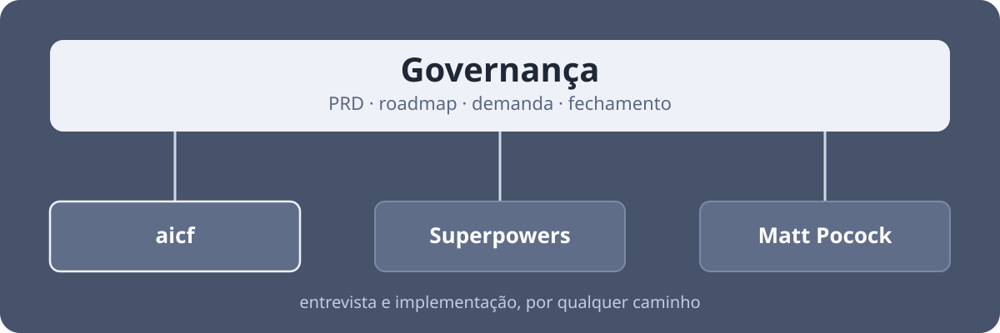

# aicf — governança de projeto para desenvolver com agentes

_[English version](README.en.md)_



O aicf é um plugin de skills para Claude Code que cuida da governança do projeto: o PRD, o roadmap, o registro de cada demanda e o relatório do que foi entregue. São seis skills, e elas funcionam por cima do caminho de implementação que você já usa.

Superpowers, Matt Pocock e spec-kit cobrem bem uma demanda por vez. Três perguntas ficam sem resposta:

- **Onde o projeto está?** As specs descrevem cada mudança, uma por uma. Nenhuma delas diz o que o produto é, para quem serve e o que ficou de fora por decisão.
- **Por que decidimos não fazer aquilo?** O motivo de descartar um caminho ficou na conversa com o agente, e a conversa não é salva. Semanas depois a mesma discussão volta.
- **O que saiu de fato?** A spec e o plano foram escritos antes de executar. Nenhum dos dois é atualizado com o que mudou durante a implementação.

## Instalação

```
/plugin marketplace add hmaurus/skills
/plugin install aicf@aicodingflow
```

Reinicie a sessão depois de instalar. As skills carregam no início da sessão e não trocam a quente.

Em projeto novo, comece por `/aicf:setup`. Em projeto que já existe, por `/aicf:workflow-demanda`, que explica o ciclo.

## O ciclo

Toda demanda passa pelas mesmas quatro fases.


- **Demanda** — a ideia registrada, mesmo antes de estar madura.
- **Entrevista** — perguntas até não sobrar decisão em aberto. Sai uma spec.
- **Implementação** — alguém executa a spec, por qualquer caminho.
- **Fechamento** — o relatório do que foi feito, com o que saiu diferente do planejado.

Cada demanda é um arquivo versionado no repositório, ou uma issue do GitHub. Você escolhe qual no setup.

## O problema que isso resolve

### Onde o projeto está?

`/aicf:criar-prd` entrevista você e escreve o `PRD.md`. Ele tem uma seção "fora de escopo, por decisão", que guarda o que você resolveu não fazer e o motivo.

### Por que decidimos não fazer aquilo?

`/aicf:criar-spec` conduz a entrevista de uma demanda e grava o resultado num arquivo do repositório, incluindo o que foi decidido **não** fazer.

### O que saiu de fato?

`/aicf:fechar-demanda` pede um relatório do que foi entregue e o guarda junto da demanda. Ele roda em qualquer caminho de implementação, inclusive nos que não são do aicf.

## Começando um projeto novo

**1. `/aicf:setup`.** Monta a base: o `PRD.md`, o lugar onde as demandas vão morar e o `CLAUDE.md` da raiz, que é o arquivo que o agente lê no início de toda sessão.

Ele pergunta o nome do projeto, uma ou duas frases sobre ele, se a demanda vive em arquivo ou em issue, onde ficam os padrões de engenharia e quais ferramentas você já usa. Se o diretório ainda não for um repositório git, ele oferece o `git init` antes da pergunta sobre onde as demandas moram. No fim, deixa o que criou no primeiro commit em `main` e te entrega em `develop`, a branch de trabalho.

**2. Preencher o `PRD.md`.** Ele nasce com as seções e uma pergunta em cada uma. `/aicf:criar-prd` entrevista seção por seção e escreve o arquivo, começando pelo problema em vez da solução.

<details>
<summary>Por que o PRD não passa pelo ciclo da demanda</summary>

Uma spec descreve uma mudança, com escopo e um estado "pronto". O PRD descreve o produto, e é revisado toda vez que uma decisão o contraria. Se o PRD virasse uma demanda, a entrevista dela discutiria como escrever o arquivo, e as perguntas que importam (público, fora de escopo) continuariam sem resposta. Depois viria um fechamento pedindo relatório, arquivamento e check de lint num `.md`.

</details>

**3. Listar o que o produto precisa ter.** Cada item vira uma linha do `ROADMAP.md`, ou uma issue de backlog. Quando um item ganha registro próprio, a linha dele sai do roadmap, para não haver dois lugares guardando o mesmo item.

**4. Primeira demanda.** `/aicf:criar-spec` para amadurecer, `/aicf:implementar-spec` para executar e fechar. Daí em diante o ciclo se repete.

As fases de entrevista e de implementação aceitam caminhos de fora do aicf, se você já usa outras coleções de skills. A governança não muda, e a demanda anota qual caminho foi usado.

## As skills

São seis. A diferença entre elas é quem pode chamar cada uma.

**Você digita.** Só existem quando você as chama, e conduzem uma sessão inteira.

| Skill | Quando | O que faz |
| --- | --- | --- |
| `/aicf:setup` | uma vez, no projeto novo | Inicializa o repositório git se faltar, pergunta se a demanda mora em arquivo ou em issue e monta o que a escolha pedir: `docs/projeto/` com PRD, roadmap e as pastas de demanda, ou o repositório no GitHub e os três labels `aicf:*`. Nos dois casos cria o `CLAUDE.md` (com `AGENTS.md` apontando para ele), um `README.md`, os padrões de engenharia se você quiser, o primeiro commit em `main` e a branch `develop` |
| `/aicf:criar-prd` | começo do projeto | Entrevista sobre o produto e escreve o `PRD.md`. Roda de novo quando uma decisão o contraria |

**Você digita, ou o agente alcança sozinho.** Respondem a pedidos em linguagem natural, como "me entreviste sobre X" ou "implementa a spec Y", e o agente as carrega quando reconhece a intenção.

| Skill | Quando | O que faz |
| --- | --- | --- |
| `/aicf:workflow-demanda` | o mapa | O ciclo, os caminhos de cada fase e as convenções de governança |
| `/aicf:criar-spec` | fase de entrevista | Interroga até não sobrar decisão em aberto, depois escreve a spec, com a sugestão de caminho de implementação. `/aicf:criar-spec #12` adota uma issue que já existe |
| `/aicf:implementar-spec` | fase de implementação | Decide o caminho pela sugestão da spec, implementa e verifica. Ao final chama o fechamento |
| `/aicf:fechar-demanda` | fase de fechamento | Checks, relatório, arquivamento e promoção de conhecimento, por qualquer caminho de implementação |

As skills são pequenas de propósito. Elas dizem o que o agente não teria como inferir: onde gravar, o que registrar e quando fechar. O que a ferramenta já faz bem, e o que se decide melhor no caso concreto, fica com o agente.

<details>
<summary><strong>Onde as coisas ficam</strong> — a estrutura de pastas, ou os labels</summary>

No modo arquivo, a pasta diz a maturidade do documento:

```
docs/projeto/
├── PRD.md             # o porquê do produto: visão, público, modelo
├── ROADMAP.md         # o que ainda não tem arquivo: Próximas e Backlog
├── backlog/           # ainda não está claro que será feita
├── intents/           # decidida, ainda não entrevistada
├── specs/             # pronta para implementar
└── concluidas/        # arquivadas, com relatório
```

Uma demanda é a unidade de trabalho. O arquivo que a descreve nasce como **intent**, vira **spec** quando está pronta para implementar (o mesmo arquivo, movido) e termina em `concluidas/` com o relatório. As quatro pastas ficam no mesmo nível, para que mover o arquivo não quebre os links relativos que saem dele.

No modo issue, a maturidade fica num label (`aicf:backlog`, `aicf:intent`, `aicf:spec`). A demanda é uma issue só, do nascimento ao fechamento: o label troca, o número não. Concluída é a issue fechada, com o relatório num comentário. Nesse modo `docs/projeto/` guarda só o `PRD.md`. O PRD, os ADRs e o glossário ficam em arquivo nos dois modos.

Você troca de modo editando uma linha do `CLAUDE.md`. A linha ausente significa arquivo, então projeto criado antes desta opção segue funcionando sem tocar em nada. A escolha vale do ponto em diante: não há migração, o que está em arquivo fica onde está, e demanda nova nasce na mídia nova.

| | Arquivo | Issue |
| --- | --- | --- |
| Setup | nenhum | precisa de `gh`, login e remote |
| Offline | sobrevive ao `git clone` sem rede | não |
| Busca | entra no `grep` do repositório | busca do GitHub |
| Conversa | não tem | comentário e notificação |
| Contribuição de fora | pull request | dois cliques |
| Referência | caminho do arquivo | `#12`, e `Fixes #12` fecha pelo merge |

O default é arquivo, porque funciona sem `gh`, sem login e sem remote.

Se o seu projeto precisar de outra estrutura, escreva a diferença no `CLAUDE.md` da raiz ou em `.claude/rules/`, nunca num `CLAUDE.md` dentro de `docs/projeto/`. Um `CLAUDE.md` de subpasta só entra no contexto quando o agente lê um arquivo daquela pasta, e registrar uma demanda nova não exige isso.

</details>

<details>
<summary><strong>Comandos vizinhos que valem conhecer</strong> — e para que serve cada um</summary>

Nenhum deles vem com o aicf. São das coleções [Superpowers](https://github.com/obra/superpowers) e [Matt Pocock](https://github.com/mattpocock/skills), e valem se você já as tem instaladas.

**Antes de escrever a demanda**

- `grill-me` e `grill-with-docs` (Matt) — contestam a ideia com perguntas, até cada ramo da decisão estar resolvido. Não gravam nada; o resultado entra na entrevista.
- `wayfinder` (Matt) — mapeia um pedido grande demais para uma sessão como tickets de decisão no seu tracker, e resolve um por vez. O mapa vale para aquele pedido.
- `domain-modeling` (Matt) — grava o vocabulário do projeto num `CONTEXT.md`.

**Na fase de entrevista, no lugar de `/aicf:criar-spec`**

- `brainstorming` (Superpowers) — entrevista e, no caminho _architectural_, grava um design doc que vale como spec.
- `grill-with-docs` + `to-spec` (Matt) — a mesma coisa em dois passos, terminando com a spec publicada no tracker.

**Na fase de implementação, no lugar de `/aicf:implementar-spec`**

- `writing-plans` + `subagent-driven-development` (Superpowers) — o plano vai para arquivo, e subagentes executam tarefa por tarefa.
- `to-tickets` + `implement` (Matt) — a spec vira tickets com dependência declarada entre eles, executados um a um.
- `code-review` (Matt) — revisa o diff em dois eixos, padrões do repositório e fidelidade à spec, em subagentes paralelos.

Dá para entrevistar por um caminho e implementar por outro. Esses fluxos gravam quantidades diferentes de documentação: nos caminhos do próprio aicf o plano de implementação não é persistido no repositório.

</details>

<details>
<summary><strong>Por que este, e não o Superpowers, o Matt Pocock, o GSD ou o BMAD</strong></summary>

O Superpowers e as skills do Matt Pocock cobrem uma demanda por vez: entrevistam a ideia, produzem uma spec, quebram em tarefas e executam. Os dois gravam arquivos. O Superpowers grava spec e plano no caminho _architectural_. O Matt publica spec e tickets no tracker escolhido no setup dele (GitHub, GitLab, markdown local, ou outro descrito em prosa) e mantém glossário e ADRs.

Esses arquivos descrevem uma demanda e são escritos antes da execução. Três coisas não aparecem em nenhum dos dois:

- **Documento de produto.** Nenhum deles cria um arquivo dizendo o que o produto é, para quem serve e o que ficou fora por decisão. O Matt guarda pedidos recusados em `.out-of-scope/<conceito>.md`, com o motivo. Isso cobre um pedido de cada vez.
- **Planejamento entre demandas.** O `brainstorming` do Superpowers decompõe um pedido grande em subprojetos e trabalha o primeiro; os outros ficam na conversa. O `wayfinder` do Matt monta um mapa de tickets para um pedido grande, com `Not yet specified` para o que ainda não dá para detalhar, e esse mapa termina junto com aquele trabalho. Nenhum dos dois mantém uma lista que atravesse várias demandas.
- **Registro depois da execução.** O `implement` do Matt termina no commit; não fecha o ticket nem marca critérios de aceite. O Superpowers revisa o código contra o plano a cada tarefa, mas não atualiza o plano nem a spec com o que mudou. No aicf o `fechar-demanda` pede um relatório na própria demanda, e é ali que ficam as diferenças entre o que foi planejado e o que saiu.

Se você já usa uma dessas coleções, pode continuar usando. O aicf cuida só da governança, e ela funciona igual em qualquer caminho de implementação.

**GSD e BMAD já têm essa parte.** O `PROJECT.md` do GSD Core tem "What This Is", "Core Value", "Out of Scope" com o motivo e "Key Decisions"; `complete-milestone` e `extract-learnings` fazem o que o `fechar-demanda` faz aqui. A diferença é que nos dois a governança vem junto com um motor de execução próprio: 72 comandos `/gsd-*` no GSD Core, 30 skills e `uv` obrigatório no BMAD. O aicf deixa esse motor de fora por decisão ([ADR 0001](docs/adr/0001-fronteira-de-fase.md)): dentro da fase de implementação quem manda é o método que você escolheu. O GSD entrega mais coisas que o aicf. A escolha é entre adotar o motor de execução dele ou manter o seu.

</details>

## Sobre

Feito para o curso [Claude Code: Criador de Apps](https://aicodingflow.com/curso), do [AI Coding Flow](https://aicodingflow.com). Use à vontade, com ou sem o curso.

MIT.
